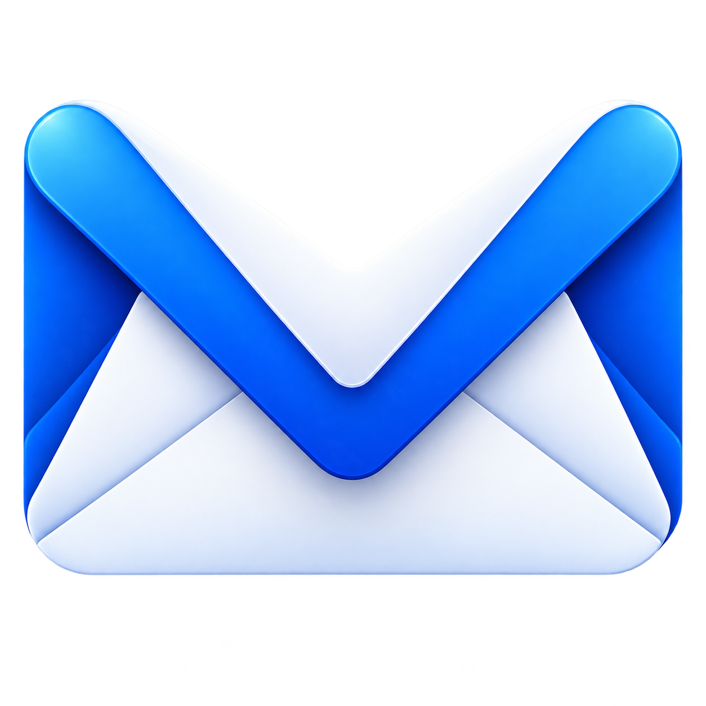

<div align="center">
  
  <h1>CoreMail</h1>
  <p><b>A blazingly fast, multi-account desktop email client built with Electron & React.</b></p>
  
  [](https://github.com/Angelokh22/CoreMail/actions)
  [](https://electronjs.org/)
  [](https://reactjs.org/)
  [](https://sqlite.org/)
</div>

<br/>

CoreMail is a fast, lightweight, and completely private desktop email client. It communicates directly with your email providers via standard IMAP/SMTP protocols and stores all of your data, credentials, and settings locally using a pure WebAssembly SQLite database.

## ✨ Features

- **📬 Multi-Account Support:** Seamlessly connect and switch between Gmail, Outlook, Titan, or any custom IMAP/SMTP provider.
- **⚡ Real-Time Push Notifications:** Uses persistent IMAP IDLE connections to instantly push new mail and trigger native desktop notifications.
- **🔍 Smart Auto-Discovery:** Simply type your email address and CoreMail queries DNS MX records to automatically detect your host servers.
- **📜 Infinite Scroll:** Blazing fast envelope syncing. Emails load instantly as you scroll, fetching full body content and attachments on demand.
- **🎨 Native System Theming:** Automatically adapts to your operating system's light or dark mode preferences instantly.
- **🔒 Completely Private:** No middleware servers. Your credentials and emails never touch our servers—everything is encrypted and saved directly to your hard drive.

## 🛠️ Tech Stack

- **[Electron](https://www.electronjs.org/)** for the cross-platform desktop shell.
- **[React](https://reactjs.org/)** & **[Vite](https://vitejs.dev/)** for a lightning-fast frontend.
- **[Bootstrap 5](https://getbootstrap.com/)** for clean, responsive UI components.
- **[sql.js (WebAssembly)](https://sql.js.org/)** for zero-dependency, ultra-fast local data storage.
- **[IMAPFlow](https://imapflow.com/)** & **[MailParser](https://nodemailer.com/extras/mailparser/)** for modern, secure email communication.

## 🚀 Getting Started

### 1. Download the App
Because CoreMail uses GitHub Actions, you don't need to compile it yourself! Simply go to the **[Releases / Actions Tab](https://github.com/Angelokh22/CoreMail/actions)** and download the pre-compiled executable for your platform:
- `.exe` for Windows
- `.dmg` for macOS
- `.AppImage` or `.deb` for Linux

### 2. Build from Source
If you prefer to compile it yourself, you need [Node.js](https://nodejs.org/) (v18+) installed.

```bash
# 1. Clone the repository
git clone https://github.com/Angelokh22/CoreMail.git
cd CoreMail

# 2. Install dependencies
npm install

# 3. Start the application in development mode
npm run dev

# 4. Build the executable for your current OS
npm run build
```

## 📂 Where is my data stored?
All of your downloaded emails, settings, and credentials are kept in a single, local SQLite database file:
- **Windows:** `C:\Users\<YourUsername>\AppData\Roaming\coremail\coremail.db`
- **macOS:** `~/Library/Application Support/coremail/coremail.db`
- **Linux:** `~/.config/coremail/coremail.db`

To completely wipe your account and start fresh, simply delete this file.

---
<div align="center">
  <i>Built with ❤️ for privacy-focused email management.</i>
</div>
